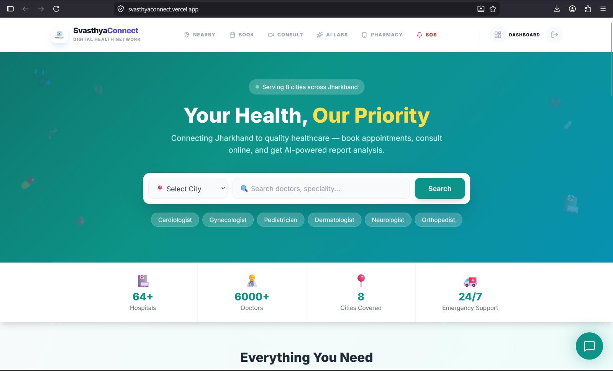
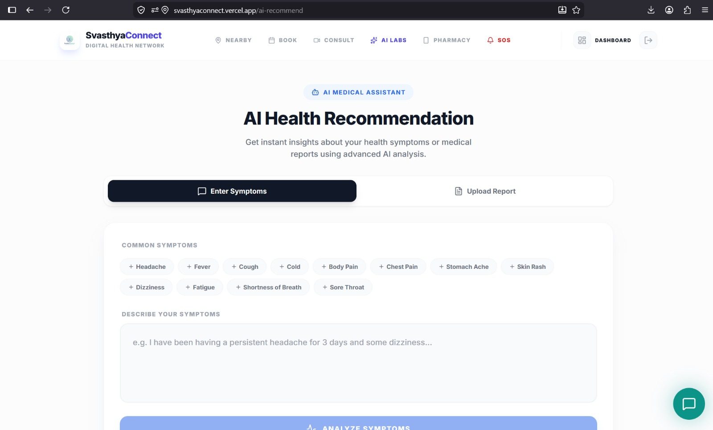
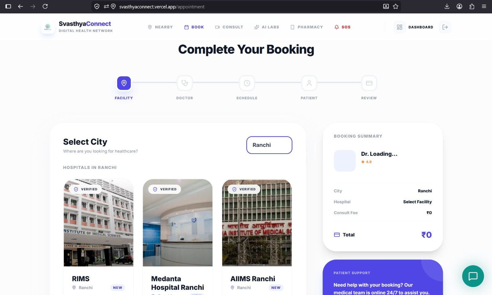
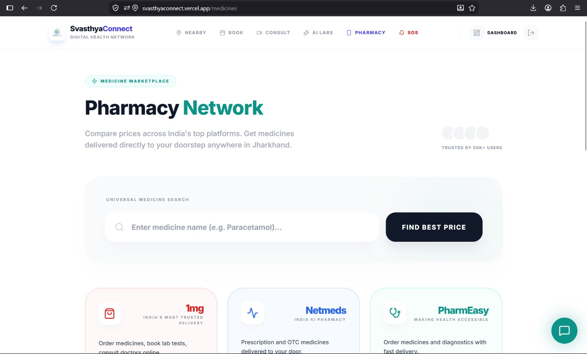
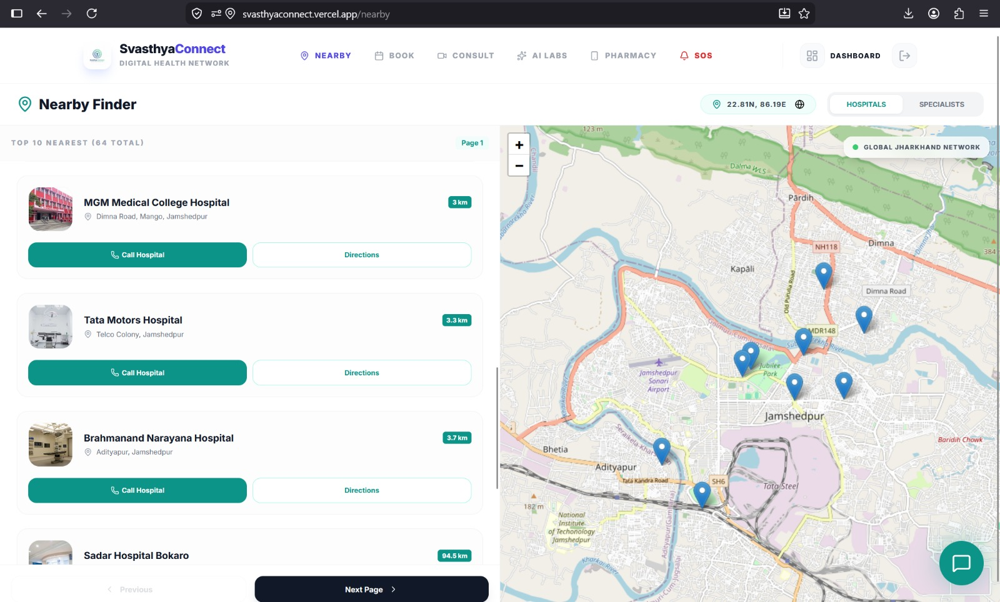
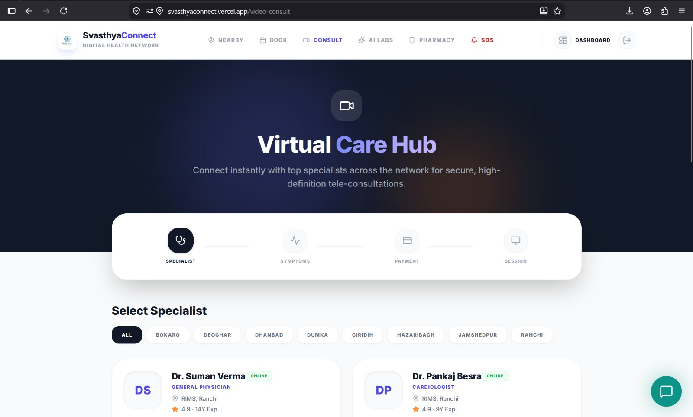

# 🏥 SvasthyaConnect

An AI-powered full-stack MERN healthcare platform that connects patients with doctors, hospitals, appointments, medical reports, AI health assistance, nearby healthcare services, and video consultations.

---

## 🚀 Live Demo

### Frontend
[🌐 Live Frontend](https://svasthyaconnect.vercel.app)

### Backend
[⚙️ Backend API](https://ehealthcare-full-backend-1.onrender.com)

### Health Check
[🩺 API Health Check](https://ehealthcare-full-backend-1.onrender.com/api/health)

---

# ✨ Features

- 🔐 JWT Authentication & Secure Login
- 👨‍⚕️ Doctor Discovery
- 🏥 Hospital Search
- 📅 Appointment Booking
- 📹 Video Consultation
- 📍 Nearby Healthcare Services
- 📄 Medical Report Upload
- 💊 Prescription Upload
- 🤖 AI Symptom Analysis
- 🧠 AI Medical Report Analysis
- 👤 Profile Management

---

# 📸 Project Screenshots

### 🏠 Dashboard


---

### 🤖 AI Health Recommendation


---

### 📅 Appointment Booking


---

### 💊 Pharmacy Network


---

### 📍 Nearby Hospital Finder


---

### 🎥 Video Consultation


---

# 🛠 Tech Stack

## Frontend
- React.js
- Vite
- Tailwind CSS
- Bootstrap
- Axios
- React Router
- Leaflet Maps

## Backend
- Node.js
- Express.js
- MongoDB Atlas
- Mongoose
- JWT
- Bcrypt
- Multer
- Tesseract.js
- Google Gemini AI
- Groq SDK

## Deployment
- Vercel
- Render
- MongoDB Atlas

---

# 📁 Project Structure

```bash
SvasthyaConnect/
│
├── client/
│   ├── src/
│   ├── public/
│
├── server/
│   ├── src/
│   │   ├── config/
│   │   ├── controllers/
│   │   ├── middleware/
│   │   ├── models/
│   │   └── routes/
│
└── README.md
```

---

# 🔗 API Base URL

```bash
https://ehealthcare-full-backend-1.onrender.com/api
```

---

# 📡 API Endpoints

## Authentication

```http
POST /api/auth/register
POST /api/auth/login
```

## Users

```http
GET /api/users/profile
PUT /api/users/update
```

## Doctors

```http
GET /api/doctors
GET /api/doctors/:id
```

## Hospitals

```http
GET /api/hospitals
GET /api/hospitals/:id
```

## Appointments

```http
POST /api/appointments
GET /api/appointments/my
```

---

# ⚙️ Environment Variables

## Backend (.env)

```env
PORT=5000
MONGO_URI=your_mongodb_uri
JWT_SECRET=your_secret
GEMINI_API_KEY=your_key
GROQ_API_KEY=your_key
```

## Frontend (.env)

```env
VITE_API_BASE_URL=http://localhost:5000/api
```

---

# 💻 Local Setup

## Clone Repository

```bash
git clone https://github.com/amitkumarmadina/Ehealthcare_Full_Frontend.git

cd Ehealthcare_Full_Frontend
```

## Install Dependencies

### Backend

```bash
cd server

npm install

npm run dev
```

### Frontend

```bash
cd client

npm install

npm run dev
```

---

# 🔒 Security

Add the following to `.gitignore`

```gitignore
node_modules
.env
uploads
dist
```

---

# 📘 Documentation & Project Guide

[📄 View Full Documentation](https://drive.google.com/file/d/1Xx9i_4O-qSKDX1kRJj0opPQreq5enrEa/view?usp=drivesdk)

---

# 👨‍💻 Author

Developed by **Amit Kumar Madina**

- GitHub: https://github.com/amitkumarmadina
